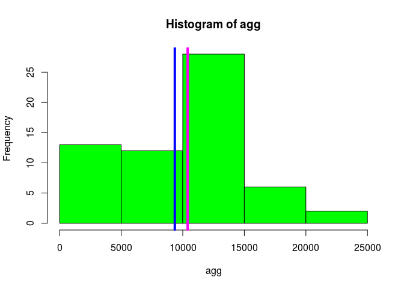
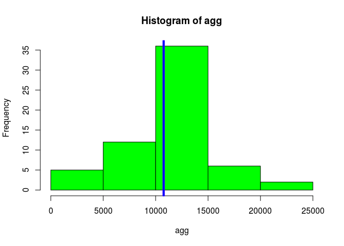
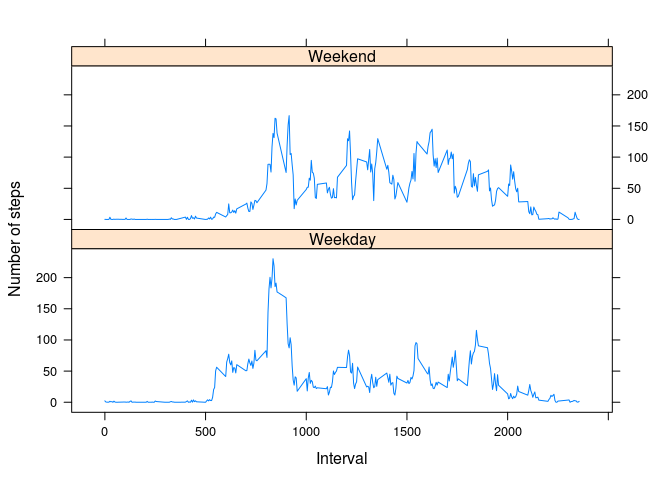

# Reproducible Research: Peer Assessment 1


## Loading and preprocessing the data

```r
data <- read.csv("activity.csv", stringsAsFactors = FALSE)
data$date <- as.Date(data$date)
agg <- tapply(data$steps, data$date, FUN = sum, na.rm = TRUE)

hist(agg, col = "green")
abline(v = median(agg), col = "magenta", lwd = 4)
abline(v = mean(agg), col = "blue", lwd = 4)
```

 
## What is mean total number of steps taken per day?

Here is the mean:

```r
mean(agg)
```

```
## [1] 9354.23
```
Here is the median:

```r
median(agg)
```

```
## [1] 10395
```

## What is the average daily activity pattern?


```r
agg <- tapply(data$steps, data$interval, FUN = mean, na.rm = TRUE)
plot(names(agg), agg,
     type="l",
     xlab="5 min intervals",
     ylab="Average activity over 5 min intervals")
```

 

The the interval containing the maximum average number of steps and the maximum value are: 

```r
agg[which.max(agg)]
```

```
##      835 
## 206.1698
```

## Imputing missing values
The number of missing values:

```r
sum(is.na(data))
```

```
## [1] 2304
```
To impute the missing values with the mean for that time interval:

```r
missing <- is.na(data$steps)
imputed <- data
imputed[missing,1] <- agg[as.character(data[missing,3])]
```
and plot the total number of steps with the imputed data:

```r
agg <- tapply(imputed$steps, imputed$date, FUN = sum, na.rm = TRUE)
hist(agg, col = "green")
abline(v = median(agg), col = "magenta", lwd = 4)
abline(v = mean(agg), col = "blue", lwd = 4)
```

 
Here is the mean:

```r
mean(agg)
```

```
## [1] 10766.19
```
Here is the median:

```r
median(agg)
```

```
## [1] 10766.19
```
The impact of imputing missing data on the estimates of the total daily number of steps is that they are higher on average.

## Are there differences in activity patterns between weekdays and weekends?


```r
factorvec <- factor(weekdays(as.Date(imputed$date)))
levels(factorvec) <- list(Weekday = c("Monday", "Tuesday", "Wednesday", "Thursday", "Friday"), Weekend = c("Saturday", "Sunday"))

library(lattice)
meansteps <- aggregate(imputed$steps, by=list(imputed$interval, factorvec),mean, na.rm = TRUE)
names(meansteps) <- c("interval","factorvec","steps")
xyplot(steps~interval | factorvec, data = meansteps,type="l",
       layout=c(1,2),xlab="Interval",ylab = "Number of steps")
```

 
